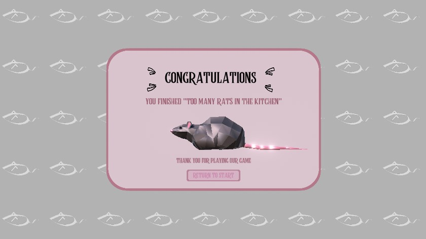
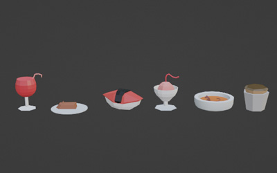

# Too Many Rats in the Kitchen - Unity

This is a third-person simulation game developed as a group project for the course *Computer Graphics and Game Technology* at the University of Ljubljana, Faculty of Computer and Information Science. The game is built in Unity and allows players to step into the role of a chef battling a rat infestation in their restaurant kitchen, aiming to eliminate rats while fulfilling food orders under a time limit.

## Authors
- Clara Jantson-Köstner
- Brina Plestenjak ([BriBerrry](https://github.com/BriBerrry))
- Ana Poklukar ([anapoklukar](https://github.com/anapoklukar))

## Table of Contents
- [Game Overview](#game-overview)
- [Game World](#game-world)
  - [Environment](#environment)
  - [Background Elements](#background-elements)
  - [Key Locations](#key-locations)
  - [Object Design](#object-design)
  - [Time Mechanics](#time-mechanics)
- [Game Engine and Technologies](#game-engine-and-technologies)
- [Camera and UI](#camera-and-ui)
- [Characters](#characters)
- [User Interface](#user-interface)
- [Music and Sound](#music-and-sound)

## Game Overview
In *Too Many Rats in the Kitchen*, players control a chef tasked with removing rats from the kitchen while preparing and serving dishes. The game is a cooking simulation with simple controls: `WASD` for movement and `Space` for interactions. Although straightforward, the increasing pressure of orders and impatient guests creates a fast-paced and challenging experience.

## Game World

### Environment
The game is set entirely in a kitchen environment, where players can move the chef in two dimensions and interact with kitchen appliances and rats. The game adopts a cartoony, simplified style with flat shading, minimalistic textures, and low-poly models to achieve a playful and accessible aesthetic.

### Background Elements
Visible through a serving window and open rooftop, players can see the restaurant dining area, featuring tables, chairs, and minimalistic decorative elements. Additionally, simple models depict areas outside the restaurant, including a road and a park with trees, to provide context and atmosphere.

### Key Locations
The kitchen is divided into several essential areas, each associated with specific tasks:
- **Stove and Pans**: Located on the left, used for cooking rats.
- **Blenders**: Positioned in the center, used to make rat wine.
- **Sink and Fridge**: Used for preparing soups and storing ingredients.
- **Serving Window**: Located at the top, where prepared dishes are served to guests.
- **Trash Can**: Found on the far right, for discarding waste or burnt dishes.

### Object Design
We used a mix of original and third-party models, notably from the KayKit: Restaurant Bits package, which uses a single texture for all models to minimize file size. Custom objects, like the chef and rat models, were created and textured in Blender.

### Time Mechanics
Each in-game day lasts 3 minutes, and the game spans 5 days. Guests wait a maximum of 40 seconds per order, and cooking times vary by dish, adding to the challenge.

## Game Engine and Technologies
This game was developed in Unity using C#. The project utilizes Shader Graph to create visual effects like fire, smoke, and water. The kitchen lighting includes baked and dynamic lights, creating realistic shadows and enhancing the atmosphere.

## Camera and UI
The camera is fixed, providing a top-down view of the kitchen, giving players an overview of all key locations and rat movements. Visual cues such as checkmarks and exclamation marks guide players to completed and urgent tasks. An order list is displayed at the bottom of the screen to avoid obstructing gameplay.

## Characters

### Chef
The chef character is controlled by the player and can perform various actions to handle kitchen tasks. The character model includes animations for walking, interacting with objects, and carrying dishes or ingredients.

### Rats
Rats move randomly around the kitchen. They are generated dynamically and roam the environment independently.

## User Interface
The game starts with a main menu, offering options to begin gameplay. During gameplay, a list of orders is shown at the bottom, with additional icons indicating the status of dishes. Visual feedback is given through alerts and indicators to streamline the player’s experience.

## Music and Sound

The game features **["George Street Shuffle"](https://incompetech.com/music/royalty-free/index.html?isrc=USUAN1300035)** by Kevin MacLeod as background music, creating a prestigious restaurant ambiance. [Sound effects](https://freesound.org) include beeping for the stove, blender mixing, frying sounds, cash register chimes for completed orders, a bell for new orders, and clicking in the UI. All audio is sourced from CC0 or Creative Commons Zero licenses.

## Resources
- [KayKit: Restaurant Bits](https://kaylousberg.itch.io/restaurant-bits)
- [Cartoon Fire - Shader Graph VFX Unity Tutorial](https://youtu.be/qE6kRTOKzU0?si=Ez62EKCRsVk1a0f1)
